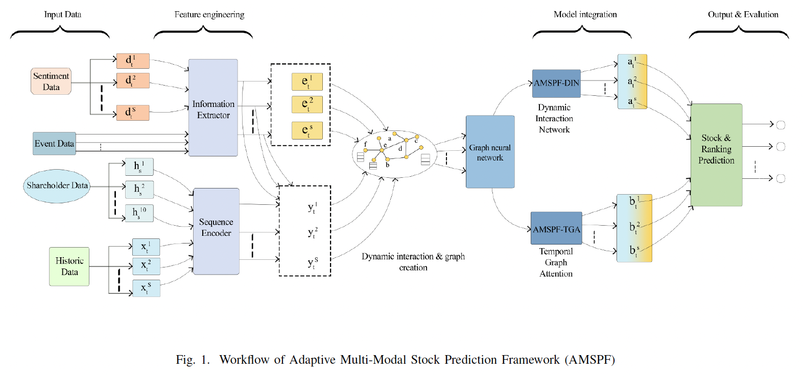
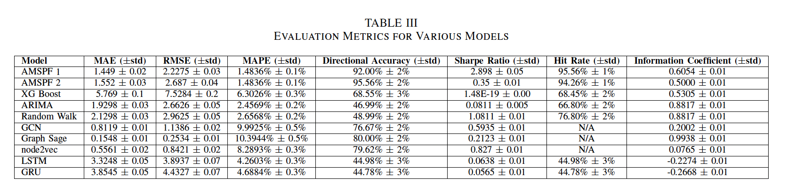
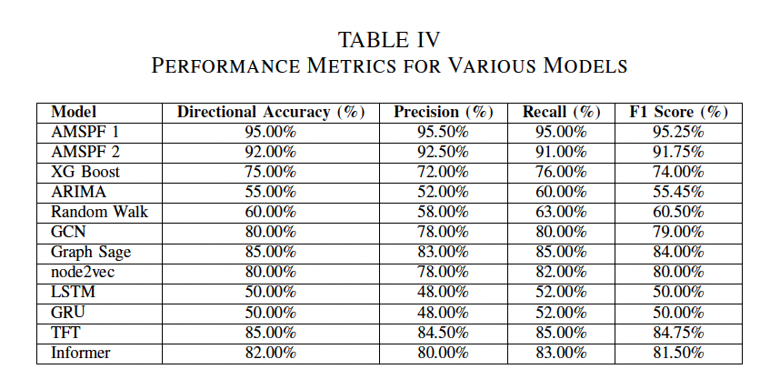

# REAL-TIME ADAPTIVE MULTI‑MODAL STOCK PREDICTION (AMSPF)

*Predicting tomorrow’s prices by adapting to today’s market dynamics*

[](https://github.com/abhishekjoshi007/Real-Time-Adaptive-Multi-Modal-Stock-Prediction/commits/main)
[](https://github.com/abhishekjoshi007/Real-Time-Adaptive-Multi-Modal-Stock-Prediction/search?l=python)
[](LICENSE)

---
## Link - https://ieeexplore.ieee.org/document/11050541

## Table of Contents

* [Overview](#overview)
* [Architecture Overview](#architecture-overview)
* [Project Structure](#project-structure)
* [Dataset](#dataset)
* [Key Components](#key-components)
* [Evaluation Metrics](#evaluation-metrics)
* [Results Snapshot](#results-snapshot)
* [Setup & Run](#setup--run)

  * [Requirements](#requirements)
  * [Installation](#installation)
  * [Data Preparation](#data-preparation)
  * [Training](#training)
  * [Evaluation](#evaluation)
* [Citation](#citation)
* [License](#license)
* [Contact](#contact)
* [Acknowledgments](#acknowledgments)

---

## Overview

**AMSPF** is a real‑time, multi‑modal forecasting framework that unifies **historical market data, volume‑weighted sentiment, volatility signals, event flags,** and **dynamic graph relationships** to predict next‑day stock returns in the technology sector. By combining a **Volatility‑Aware Transformer (VAT)**, **Graph Attention Networks (GAT)**, and a **Dynamic Interaction Network (DIN)**, AMSPF adapts feature importance on‑the‑fly and delivers state‑of‑the‑art directional accuracy, Sharpe ratio, and hit‑rate performance.

*Paper*: **“Real‑Time Adaptive Multi‑Modal Stock Prediction with Temporal Graph Attention and Dynamic Interaction Networks”** — IEEE Conference on Artificial Intelligence (CAI) 2025.

---

## Architecture Overview



### Modules

| Layer                               | Purpose                                                                            |
| ----------------------------------- | ---------------------------------------------------------------------------------- |
| **Input Streams**                   | OHLCV sequences · Reddit & Yahoo Finance comments · Macro indicators · Event flags |
| **Dynamic Graph Builder**           | Constructs daily graphs (correlation · common holders · sentiment similarity)      |
| **Volume‑Weighted Sentiment (VWS)** | Amplifies sentiment by trading volume to filter noise                              |
| **Volatility Detector (EWMA)**      | Identifies high/low‑vol regimes and feeds σ<sub>t</sub> to VAT                     |
| **Feature Encoders**                | LSTM (prices) · Text encoder (FinBERT)                                             |
| **Graph Encoder**                   | GAT with temporal snapshots or DIN for real‑time edges                             |
| **Fusion & Prediction**             | VAT + Event‑Triggered Attention → MLP → next‑day return                            |
| **Recommendation Engine**           | Momentum α, Volatility β, and Sentiment weights → composite rank                   |

---

## Project Structure

```bash
Real-Time-Adaptive-Multi-Modal-Stock-Prediction/
├── Comparison Models/          # Baselines: ARIMA, XGBoost, Random Walk
├── Data Extractions Scripts/   # Raw data scrapers & cleaners
├── Merged Data/                # Pre‑merged CSVs & GraphMLs (⭑ >100 MB, use LFS)
├── USP-1/                      # Volume‑Weighted Sentiment pipeline
├── USP-2/                      # Volatility‑Aware Transformer (VAT)
├── USP-3/                      # Event‑Triggered Attention & DIN
├── USP-4/                      # GAT + Recommendation Engine
├── conda.yml                   # Reproducible environment spec
├── requirements.txt            # Pip fallback
├── utils/                      # Figures & helper scripts
└── README.md
```

---

## Dataset

| Source                              | Span                | Fields                                                           |
| ----------------------------------- | ------------------- | ---------------------------------------------------------------- |
| **Yahoo Finance**                   | 1 Aug – 31 Oct 2024 | OHLCV for 139 tech tickers                                       |
| **Reddit & Yahoo Finance comments** | Same window         | Raw posts → FinBERT sentiment → VWS                              |
| **Macro indicators**                | Monthly             | CPI, GDP, interest rate                                          |
| **Events**                          | Daily               | Earnings, M\&A, Fed announcements (spaCy keyword flags)          |
| **Dynamic graphs**                  | Daily snapshots     | Edges: correlation > 0.6 · shared holders · sentiment similarity |

> Total size ≈ 1.2 GB (download via `Data Extractions Scripts/` or use the pre‑merged files in **Merged Data/**).

---

## Key Components

* **Volume‑Weighted Sentiment (VWS)** = Σ(*sentiment* × *volume*) / Σ*volume* — boosts high‑liquidity signals.
* **Volatility‑Aware Transformer (VAT)** — injects σ<sub>t</sub> into multi‑head attention scores to adapt feature weights.
* **Event‑Triggered Attention** — extra head focusing only on event‑flagged stocks.
* **Graph Attention Network (GAT)** — captures inter‑stock relations with learnable edge weights.
* **Dynamic Interaction Network (DIN)** — re‑weights edges in real‑time for streaming inference.
* **Recommendation Engine** — ranks stocks by α·Momentum + β·Volatility + γ·VWS.

---

## Evaluation Metrics

| Metric                           | Description                                    |
| -------------------------------- | ---------------------------------------------- |
| **MAE / RMSE / MAPE**            | Regression error on next‑day close             |
| **Directional Accuracy**         | Correct up/down moves                          |
| **F1 Score**                     | Precision‑recall trade‑off                     |
| **Information Coefficient (IC)** | Pearson corr. between predicted & true returns |
| **Sharpe Ratio**                 | Risk‑adjusted return                           |
| **Hit Rate**                     | % of recommended stocks with positive return   |

---

## Results Snapshot




---

## Setup & Run

### Requirements

* Python 3.9+
* PyTorch 2.2 • PyTorch‑Geometric 2.5
* Transformers (🤗 4.43)
* scikit‑learn • pandas • numpy
* spaCy 3 (for event extraction)

### Installation

```bash
# clone
git clone https://github.com/abhishekjoshi007/Real-Time-Adaptive-Multi-Modal-Stock-Prediction
cd Real-Time-Adaptive-Multi-Modal-Stock-Prediction

# conda (recommended)
conda env create -f conda.yml
conda activate amspf

# or pip
pip install -r requirements.txt
```

### Data Preparation

```bash
# 1️⃣ Fetch & preprocess raw data (takes ~10 min)
python Data\ Extractions\ Scripts/download_all.py --start 2024-08-01 --end 2024-10-31

# 2️⃣ Build daily graphs
python Data\ Extractions\ Scripts/build_graphs.py --output Merged\ Data/graphs
```

### Training

```bash
# Volatility‑Aware Transformer (USP‑2)
python USP-2/train_vat.py --epochs 100 --batch 64 --lr 3e-4

# GAT with DIN edges (USP‑3)
python USP-3/train_gat_din.py --epochs 80 --graph_dir Merged\ Data/graphs
```

### Evaluation

```bash
python evaluate.py --ckpt runs/vat_best.pt --test_csv Merged\ Data/test.csv
```

---

## Citation

```
@INPROCEEDINGS{11050541,
  author={Joshi, Abhishek and Koda, Jahnavi Krishna and Hadimlioglu, Alihan and Kaur, Gurojaspreet},
  booktitle={2025 IEEE Conference on Artificial Intelligence (CAI)}, 
  title={Real-Time Adaptive Multi-Modal Stock Prediction with Temporal Graph Attention and Dynamic Interaction Networks}, 
  year={2025},
  volume={},
  number={},
  pages={83-88},
  keywords={Accuracy;Sensitivity;Linearity;Feature extraction;Transformers;Market research;Real-time systems;Macroeconomics;Long short term memory;Investment;Stock Price Prediction;Stock Return Prediction;Graph Attention Networks (GAT);Volatility Aware Transformer(VAT);Long Short Term Memory (LSTM)},
  doi={10.1109/CAI64502.2025.00020}}
``
```

---

## License

This project is licensed under the **MIT License** – see the [LICENSE](LICENSE) file for details.

---

## Contact

Foor questions, collaborations, or feedback:

* 💼 [LinkedIn – Abhishek Joshi](https://www.linkedin.com/in/abhishek-joshi-510b68151/)
* 📧 Email: [abhishek.07joshi@gmail.com](mailto:abhishek.07joshi@gmail.com)

---

## Acknowledgments

* Texas A\&M University–Corpus Christi
* IEEE CAI 2025 Organising Committee
* Open‑source contributors to PyTorch, PyG, HuggingFace, and spaCy


